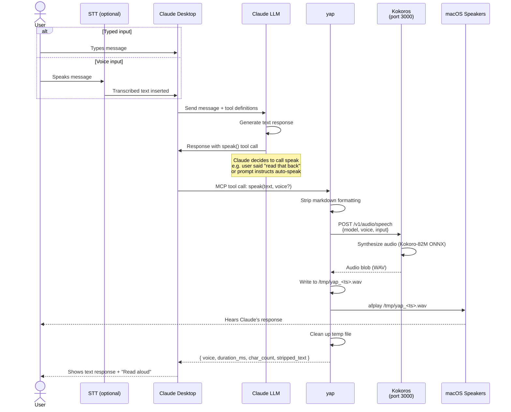

# CLAUDE.md

This file provides guidance to Claude Code (claude.ai/code) when working with code in this repository.

## What This Repo Is

`yap` is a thin **MCP wrapper** that lets Claude Desktop call a local TTS engine (Kokoros) as a `speak` tool. It is deliberately one of several clients of Kokoros — not the platform itself.

```
Kokoros (native Rust binary, port 3000)  ← the actual TTS service
    ↑
    ├── yap (this repo) → Claude Desktop via MCP stdio
    ├── Hermes / voice-loop / other agents → direct HTTP POST
    └── CLI pipe → `echo text | koko stream`
```

Key consequence: **yap stays tiny.** One file (`index.js`) for the MCP server, one pure function (`strip.js`) for markdown stripping, one harness (`smoke.js`) for end-to-end assertions. Dependencies: `@modelcontextprotocol/sdk` and `zod`. Nothing else. Anything that would benefit multiple agents belongs in Kokoros or a shared script, not inside yap.

## Architectural Decisions (don't relitigate without reason)

- **Kokoros (Rust) over kokoro-web (Python/Docker)**: single native binary, streaming support, CLI piping, ONNX runtime. CPU-only is fine — Kokoro-82M is faster than real-time on M1 Max.
- **OpenAI-compatible `/v1/audio/speech` contract**: every client (yap, Hermes, scripts) talks the same API, so the backend is swappable without touching clients.
- **Audio playback is the caller's responsibility.** yap uses `afplay` (macOS). Linux support is not in v1 — if added, abstract the player rather than hardcoding a second branch.
- **No auth on Kokoros.** Local-only. If that changes, add a reverse proxy — don't bake auth into yap.
- **Coarse single-flight lock.** One `speak` call at a time — covers both synthesis and playback. Overlapping calls return `{ error: "busy" }` immediately. Serializing synth+playback together is a conscious call: concurrent synth with serialized playback is complexity for an edge case that doesn't happen in practice.
- **No `stream` param, no `voices` tool.** Explicitly cut from v1. The 54 voices Kokoros exposes are addressable by ID through the `voice` param; a hardcoded reference list in yap would just drift.

## The `speak` Tool Contract

**Parameters:** `text` (required), `voice` (optional — leave unset to use the configured default).

The tool description tells Claude to omit `voice` unless the user explicitly asks for one. Without that nudge, Claude tends to pass a voice argument unprompted, overriding `KOKORO_DEFAULT_VOICE`. If you change the description, preserve that instruction.

**Behavior, in order:**
1. Acquire the single-flight lock. If already held, return `{ error: "busy", detail }` immediately.
2. Strip markdown from `text` via `stripMarkdown` — headings, bold, backticks, bullets, code fences, links. Kokoro reads literal characters, so unstripped markdown sounds terrible.
3. If the stripped text is empty (e.g. input was only a fenced code block), return `{ error: "empty_input", detail }` without calling Kokoros.
4. POST to `${KOKORO_URL}/v1/audio/speech` with `{ model: "tts-1", voice, input }`.
5. If the POST rejects (ECONNREFUSED etc.) or returns non-2xx: return `{ error: "tts_unavailable", detail }`. Do not throw.
6. Write the audio body to `/tmp/yap_<timestamp>.wav`. If the write fails, return `{ error: "write_failed", detail }`.
7. Spawn `afplay` on the temp file, measure wall-clock duration from spawn to exit (playback only, not synth+playback).
8. Unlink the temp file in a `finally`.
9. Release the lock in the outer `finally`.
10. Return `{ voice, duration_ms, char_count, stripped_text }`.

**Env vars:** `KOKORO_URL` (default `http://localhost:3000`), `KOKORO_DEFAULT_VOICE` (default `af_heart`). Both read inside the handler per-call — not captured at import time. Verified by `smoke.js --dead-port` and by `KOKORO_DEFAULT_VOICE=<id> node smoke.js`.

**Return shapes (six):**
- Happy: `{ voice, duration_ms, char_count, stripped_text }`
- Unreachable: `{ error: "tts_unavailable", detail }`
- Concurrent: `{ error: "busy", detail }`
- Empty after stripping: `{ error: "empty_input", detail }`
- Temp file write failure: `{ error: "write_failed", detail }`
- Playback failure: `{ error: "playback_failed", detail }`

Note: `playback_failed` and `write_failed` have no automated smoke coverage — `playback_failed` would require a live `afplay` environment plus a way to force it to exit non-zero, and `write_failed` would require an unwritable `/tmp`. The gap is deliberate, not an oversight.

## Happy Path (visual)



## Running Kokoros (dependency, not part of this repo)

Kokoros lives in a separate repo (`github.com/lucasjinreal/Kokoros`). For yap to work, Kokoros must be running:

```bash
koko openai    # binds 0.0.0.0:3000, two instances by default
```

Note: older Kokoros docs mention a `--instances 1` flag for lowest latency. The currently shipped binary does not accept it — default `koko openai` is what works.

### Optional: launchd service (always-on)

Create `~/Library/LaunchAgents/com.yap.kokoros.plist` to start Kokoros on login:

```xml
<?xml version="1.0" encoding="UTF-8"?>
<!DOCTYPE plist PUBLIC "-//Apple//DTD PLIST 1.0//EN" "http://www.apple.com/DTDs/PropertyList-1.0.dtd">
<plist version="1.0">
<dict>
    <key>Label</key>
    <string>com.yap.kokoros</string>
    <key>ProgramArguments</key>
    <array>
        <string>/usr/local/bin/koko</string>
        <string>openai</string>
    </array>
    <key>RunAtLoad</key>
    <true/>
    <key>KeepAlive</key>
    <true/>
    <key>StandardOutPath</key>
    <string>/tmp/kokoros.log</string>
    <key>StandardErrorPath</key>
    <string>/tmp/kokoros.err</string>
</dict>
</plist>
```

Then: `launchctl load ~/Library/LaunchAgents/com.yap.kokoros.plist`

## Commands

```bash
npm install                 # install deps (@modelcontextprotocol/sdk, zod)
npm test                    # run strip.js unit tests (11 cases, node:test)
node smoke.js               # happy path: plays audio, asserts return shape + temp-file cleanup
node smoke.js --dead-port   # asserts tts_unavailable when Kokoros is down
node smoke.js --empty-input # asserts empty_input shape (no Kokoros call needed)
node smoke.js --double-call # asserts the single-flight busy lock
```

Requires Node 20.11+ (for stable `node:test` + global `fetch`). ESM throughout (`"type": "module"`).

`smoke.js` requires Kokoros running on `KOKORO_URL` (default `:3000`) — except `--dead-port` mode, which deliberately overrides to a closed port.

## When Extending

- New capability that only Claude Desktop needs → add to yap.
- New capability that any agent could use → add to Kokoros or a shared script, and let yap call it like everyone else.
- If a new return shape is added to `speak`, update the return shapes list above and add an assertion mode to `smoke.js`.
- Stay tiny. No new deps without a concrete reason.

## Direct Kokoros Usage (non-MCP)

Other agents and scripts talk to Kokoros directly — yap is just the MCP bridge for Claude Desktop. These examples are useful context for understanding the boundary.

### Via HTTP (server mode)

```bash
curl -X POST http://localhost:3000/v1/audio/speech \
  -H "Content-Type: application/json" \
  -d '{"model":"tts-1","voice":"af_heart","input":"Hello from any agent"}' \
  --output /tmp/speech.wav && afplay /tmp/speech.wav
```

### Via HTTP with streaming (lower latency)

```bash
curl -s -X POST http://localhost:3000/v1/audio/speech \
  -H "Content-Type: application/json" \
  -d '{"model":"tts-1","voice":"af_heart","input":"A longer response starts playing in 1-2 seconds...","stream":true}' \
  | ffplay -f s16le -ar 24000 -nodisp -autoexit -loglevel quiet -
```

### Via CLI pipe (no server needed)

```bash
echo "Hello from the command line" | koko stream > /tmp/speech.wav && afplay /tmp/speech.wav
```
