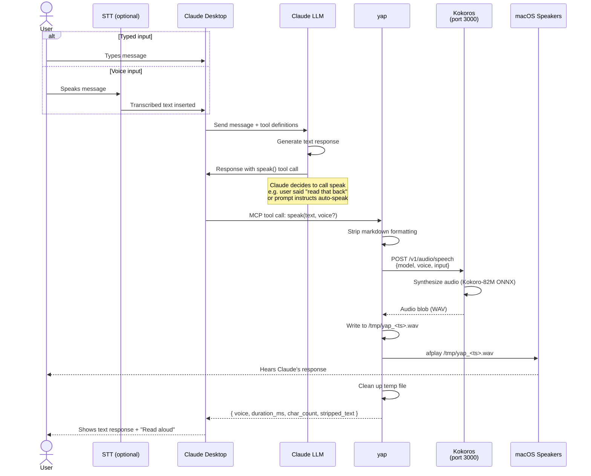

# Yap — Architecture

## What This Is
A local TTS setup with two layers:
1. **Kokoros** (Rust) — a native Kokoro TTS binary exposing an OpenAI-compatible API on port 3000. Runs directly on macOS (no Docker required). Any agent or script that can make an HTTP POST or pipe text via CLI can use it.
2. **yap** — a thin MCP wrapper so Claude Desktop can call it as a tool. This is just one client of Kokoros.

## Why Kokoros (Rust) Over kokoro-web (Python/Docker)
- **Single native binary** — no Python, no PyTorch, no espeak-ng. `cargo build --release` and done.
- **Streaming audio** — OpenAI server supports `"stream": true` for 1-2s time-to-first-audio. Long responses start playing almost immediately.
- **CLI piping** — `echo "text" | koko stream > output.wav` for dead-simple scripting without needing the HTTP server.
- **ONNX runtime** — portable model format, no GPU framework dependencies.
- **Same API contract** — OpenAI-compatible `/v1/audio/speech` endpoint, so all clients are backend-agnostic. Could swap to kokoro-web or a hosted API later without changing yap or any agent code.
- **Tradeoff**: no MPS/CoreML acceleration yet (CPU only via ONNX Runtime), but the model is 82M params — synthesis is faster than real-time on Apple Silicon CPU anyway.

## Architecture
```
Kokoros (native binary, port 3000) <- shared TTS service
    |
    +-- yap -> Claude Desktop (MCP tool: "speak") -- plays audio itself
    +-- Agent -> direct HTTP POST -- owns its own playback
    +-- CLI pipe -> echo "text" | koko stream -- owns its own playback
    +-- voice-loop script -> direct HTTP POST -- owns its own playback
    +-- any future agent/script -> direct HTTP POST -- owns its own playback
```

**Playback rule:** every client owns its own playback. yap is the deliberate exception — it plays via `afplay` because MCP stdio has no audio transport back to Claude Desktop, so Claude Desktop literally cannot own playback for this client. Other clients pick their own player (`afplay` on macOS, `aplay` on Linux, `ffplay` for streaming).

## Happy Path — User Journey



## Direct Usage (non-MCP agents)

### Via HTTP (server mode)
Any agent or script can use Kokoros directly when the OpenAI server is running:
```bash
curl -X POST http://localhost:3000/v1/audio/speech \
  -H "Content-Type: application/json" \
  -d '{"model":"tts-1","voice":"af_heart","input":"Hello from any agent"}' \
  --output /tmp/speech.wav && afplay /tmp/speech.wav
```

### Via HTTP with streaming (lower latency)
```bash
curl -s -X POST http://localhost:3000/v1/audio/speech \
  -H "Content-Type: application/json" \
  -d '{"model":"tts-1","voice":"af_heart","input":"A longer response starts playing in 1-2 seconds...","stream":true}' \
  | ffplay -f s16le -ar 24000 -nodisp -autoexit -loglevel quiet -
```

### Via CLI pipe (no server needed)
For simple scripts that don't need the HTTP server running at all:
```bash
echo "Hello from the command line" | koko stream > /tmp/speech.wav && afplay /tmp/speech.wav
```
This is useful for quick one-off agent integrations, cron jobs, or testing.

## Kokoros Setup

See the [Kokoros repo](https://github.com/lucasjinreal/Kokoros) for full install instructions (Rust toolchain, model download, build). Once installed, start the OpenAI-compatible server:

```bash
koko openai    # binds 0.0.0.0:3000
```

### Optional: run as a launchd service (always-on)
Create `~/Library/LaunchAgents/com.yap.kokoros.plist` to start on login:
```xml
<?xml version="1.0" encoding="UTF-8"?>
<!DOCTYPE plist PUBLIC "-//Apple//DTD PLIST 1.0//EN" "http://www.apple.com/DTDs/PropertyList-1.0.dtd">
<plist version="1.0">
<dict>
    <key>Label</key>
    <string>com.yap.kokoros</string>
    <key>ProgramArguments</key>
    <array>
        <string>/usr/local/bin/koko</string>
        <string>openai</string>
    </array>
    <key>RunAtLoad</key>
    <true/>
    <key>KeepAlive</key>
    <true/>
    <key>StandardOutPath</key>
    <string>/tmp/kokoros.log</string>
    <key>StandardErrorPath</key>
    <string>/tmp/kokoros.err</string>
</dict>
</plist>
```
Then: `launchctl load ~/Library/LaunchAgents/com.yap.kokoros.plist`

## yap Server (Claude Desktop layer)

### Tool: `speak`
**Parameters:**
- `text` (string, required) — the text to read aloud
- `voice` (string, optional, default `"af_heart"`) — Kokoro voicepack ID

**Behavior:**
1. Strip markdown formatting from text so it reads naturally. Handle **block-level constructs first** (code fences, block quotes) by removing the whole block — not just the fence delimiters — otherwise the code body gets spoken aloud. Then strip line-level markers (`#`, `**`, `` ` ``, bullet chars, etc.) with a regex pass. Exposed as a pure `string -> string` function so future callers with pre-cleaned text have a lever.
2. POST to `http://localhost:3000/v1/audio/speech` with OpenAI-compatible body:
   ```json
   {
     "model": "tts-1",
     "voice": "<voice param>",
     "input": "<cleaned text>"
   }
   ```
3. Write response audio blob to a temp file (`/tmp/yap_<timestamp>.wav`)
4. Spawn `afplay <tempfile>` to play it
5. Clean up temp file after playback finishes
6. Return a result object to Claude:
   ```json
   {
     "voice": "af_heart",
     "duration_ms": 2340,
     "char_count": 142,
     "stripped_text": "<what was actually sent to Kokoros>"
   }
   ```

**Concurrency:** `speak` is synchronous — it blocks until playback finishes. A second `speak` call while one is in flight is rejected with a structured error (`{ error: "busy", detail: "playback in progress" }`) rather than queued or spawned in parallel. This avoids two `afplay` processes fighting over the speaker.

**Error shape when Kokoros is unreachable:** return a structured MCP error (`{ error: "tts_unavailable", detail: "connection refused to localhost:3000" }`), not a thrown exception. This lets Claude surface "TTS unavailable" cleanly rather than show a stack trace.

**Future work (not in v1):**
- `stream` parameter for lower latency on long text. Omitted from v1 because `afplay` can't consume a stream — streaming needs a different player (e.g. `ffplay`) and a different code path end-to-end.
- `voices` tool listing available voicepacks. Hardcode the reference list below for now; add the tool when a caller actually asks for it.

## Claude Desktop Config Entry
Add to `~/Library/Application Support/Claude/claude_desktop_config.json`:
```json
{
  "mcpServers": {
    "yap": {
      "command": "node",
      "args": ["/path/to/yap/index.js"],
      "env": {
        "KOKORO_URL": "http://localhost:3000",
        "KOKORO_DEFAULT_VOICE": "af_heart"
      }
    }
  }
}
```

## Available Voices (for reference)
- `af_heart` — default female
- `af_bella`, `af_sarah`, `af_nicole`, `af_sky` — other female American
- `am_adam`, `am_michael` — male American
- `bf_emma`, `bf_isabella` — female British
- `bm_george`, `bm_lewis` — male British
- Style mixing supported: `af_sky.4+af_nicole.5` blends two voices

## Notes
- Model + voice data downloads to `checkpoints/` and `data/` (~100MB total)
- The MCP server should be as simple as possible — one file, minimal dependencies
- Use stdio transport (standard for Claude Desktop MCP servers)
- Kokoros is the shared platform — other agents should call it directly over HTTP or CLI pipe, not through MCP
- No API key required — Kokoros server has no auth by default. Add a reverse proxy if needed later
- Word-level timestamps available via `--timestamps` flag (useful for subtitle generation)
